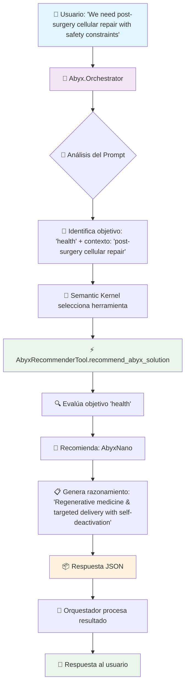

# MagIA Copilot: del conjuro al código con Semantic Kernel y Power Platform


¿Puede un hechizo escrito en lenguaje natural desencadenar una solución empresarial completa? En esta charla mágica y práctica, una bruja de Copilot y un mago de backend conjugan lo mejor del nuevo Microsoft Copilot Studio y las capacidades avanzadas de Azure AI para crear un agente que lo entiende todo. Desde las fórmulas de Semantic Kernel hasta el encantamiento de Power Automate, descubre cómo unir la visión de negocio con lo más puntero de la IA generativa.

## 🎯 ¿Qué hace este código?

Este repositorio demuestra la integración entre **Semantic Kernel** y **Microsoft Copilot Studio** para crear un sistema de agentes inteligentes que puede:

- **Responder FAQs** usando un agente de Copilot Studio con conocimiento estructurado
- **Recomendar productos** basándose en objetivos del usuario  
- **Calcular precios** y costes anuales para diferentes escenarios
- **Orquestar múltiples herramientas** automáticamente según el contexto

La demo simula "Abyx Corporation", una empresa ficticia de tecnologías avanzadas (nanobots, humanoides AI, etc.) para mostrar casos de uso realistas.

## 🏗️ Arquitectura del Sistema

El proyecto consta de 3 aplicaciones principales:

### 1. **MagIA.HelloSK** 
Ejemplo básico de Semantic Kernel conectado a Azure OpenAI.

### 2. **MagIA.Agent**
Agente de Copilot Studio que responde preguntas sobre Abyx usando un archivo JSON de FAQs.

### 3. **Abyx.Orchestrator** (⭐ Principal)
Orquestador inteligente que combina múltiples herramientas:
- **AbyxFaqAgentTool**: Conecta con Copilot Studio para FAQs
- **AbyxRecommenderTool**: Recomienda productos según objetivos
- **AbyxPricingApiTool**: Consulta precios de productos
- **CalculatorTool**: Realiza cálculos de costes

## 🚀 Configuración y Setup

### Prerrequisitos

- **.NET 9.0** o superior
- **Azure OpenAI** con un modelo de chat desplegado
- **Microsoft Copilot Studio** con un agente configurado
- **Visual Studio 2022** o **VS Code** con extensión de C#

### 1. Configurar Azure OpenAI

1. Crea un recurso de Azure OpenAI
2. Despliega un modelo (ej: `gpt-4o`)
3. Obtén el endpoint y API key

### 2. Configurar Copilot Studio

1. Ve a [Copilot Studio](https://copilotstudio.microsoft.com)
2. Crea un nuevo agente
3. Configura el conocimiento con el archivo `src/MagIA.Agent/abyx-faq.json`
4. Obtén las credenciales de conexión:
   - **App Client ID**
   - **Tenant ID** 
   - **Client Secret**
   - **Environment ID**
   - **Schema Name**

### 3. Configurar las aplicaciones

Para cada proyecto, copia el archivo template y completa los valores:

#### MagIA.HelloSK
```bash
cp src/MagIA.HelloSK/settings.template.json src/MagIA.HelloSK/settings.json
```

```json
{
  "AzureOpenAI": {
    "DeploymentName": "tu-modelo-gpt-4o",
    "Endpoint": "https://tu-recurso.openai.azure.com/",
    "ApiKey": "tu-api-key"
  }
}
```

#### MagIA.Agent
```bash
cp src/MagIA.Agent/settings.template.json src/MagIA.Agent/settings.json
```

```json
{
  "Copilot": {
    "AppClientId": "tu-app-client-id",
    "TenantId": "tu-tenant-id",
    "ClientSecret": "tu-client-secret",
    "EnvironmentId": "tu-environment-id",
    "SchemaName": "tu-schema-name"
  }
}
```

#### Abyx.Orchestrator
```bash
cp src/Abyx.Orchestrator/settings.template.json src/Abyx.Orchestrator/settings.json
```

```json
{
  "AzureOpenAI": {
    "DeploymentName": "tu-modelo-gpt-4o",
    "Endpoint": "https://tu-recurso.openai.azure.com/",
    "ApiKey": "tu-api-key"
  },
  "Copilot": {
    "AppClientId": "tu-app-client-id",
    "TenantId": "tu-tenant-id", 
    "ClientSecret": "tu-client-secret",
    "EnvironmentId": "tu-environment-id",
    "SchemaName": "tu-schema-name"
  }
}
```

## 🧪 Cómo probar

### Compilar la solución
```bash
cd src
dotnet build BizzSummit.MagIA.sln
```

### Ejecutar los ejemplos

#### 1. Ejemplo básico de Semantic Kernel
```bash
cd src/MagIA.HelloSK
dotnet run
```

#### 2. Agente de Copilot Studio
```bash
cd src/MagIA.Agent  
dotnet run
```

#### 3. Orquestador completo (⭐ Recomendado)
```bash
cd src/Abyx.Orchestrator
dotnet run
```

### Prompts de prueba

Una vez ejecutado el **Abyx.Orchestrator**, puedes probar estos prompts:

**Prompt 1 (FAQ puro):**
```
What is Abyx Eternum and how does privacy work?
```
→ Debe elegir `CopilotStudio.invoke_copilot_agent` (usa el JSON de FAQs).

**Prompt 2 (Objetivo → recomendación):**
```  
We need post-surgery cellular repair with safety constraints.
```
→ `AbyxAdvisor.recommend_abyx_solution` → devuelve AbyxNano + razonamiento.

**Prompt 3 (Precio + cálculo):**
```
Price for AbyxMind and yearly cost for 25 seats.
```
→ `AbyxPricingApi.get_product_prices` → `Calc.compute_yearly_cost` (encadenado).

## 📊 Flujo de Ejecución - Prompt 2

El siguiente diagrama muestra cómo el sistema procesa el prompt: *"We need post-surgery cellular repair with safety constraints."*



### Detalles del flujo:

1. **Input del usuario**: El sistema recibe el prompt en lenguaje natural
2. **Análisis semántico**: Semantic Kernel analiza la intención y extrae:
   - Objetivo: `health` (reparación celular)
   - Contexto: `post-surgery cellular repair with safety constraints`
3. **Selección de herramienta**: El sistema decide usar `AbyxRecommenderTool`
4. **Ejecución**: La herramienta evalúa el objetivo y devuelve:
   - Producto recomendado: `AbyxNano`
   - Justificación: Medicina regenerativa con auto-desactivación
5. **Respuesta**: El orquestador formatea y presenta el resultado al usuario

## 🛠️ Herramientas Disponibles

| Herramienta | Descripción | Casos de uso |
|-------------|-------------|--------------|
| **AbyxFaqAgentTool** | Conecta con Copilot Studio para consultar FAQs | Preguntas sobre productos, ética, soporte |
| **AbyxRecommenderTool** | Recomienda productos según objetivos | Salud, compañía, cognición, inmortalidad digital |
| **AbyxPricingApiTool** | Consulta precios de productos | Cotizaciones, comparativas de precios |
| **CalculatorTool** | Realiza cálculos matemáticos | Costes anuales, proyecciones |

## 🎭 Casos de Uso de la Demo

### Empresa Ficticia: Abyx Corporation
Simula una empresa de tecnologías futuristas con productos como:
- **AbyxNano**: Nanobots médicos (299€/mes)
- **AbyxHumanoids**: Compañeros humanoides (999€/mes)  
- **AbyxMind**: Extensión cognitiva AI (149€/mes)
- **AbyxEternum**: Backup de consciencia (499€/mes)

### Escenarios de Negocio
1. **Soporte al Cliente**: FAQs automatizadas sobre productos y políticas
2. **Consultoría de Ventas**: Recomendaciones personalizadas según necesidades
3. **Cotizaciones**: Cálculo automático de precios y costes totales

## 🏆 Beneficios de la Arquitectura

- **Modularidad**: Cada herramienta tiene una responsabilidad específica
- **Escalabilidad**: Fácil agregar nuevas herramientas y capacidades
- **Flexibilidad**: El orquestador elige la mejor herramienta automáticamente
- **Reutilización**: Las herramientas pueden usarse en diferentes contextos
- **Mantenibilidad**: Separación clara entre lógica de negocio y conectores

## 📚 Tecnologías Utilizadas

- **[Semantic Kernel](https://github.com/microsoft/semantic-kernel)** - Framework de orquestación de IA
- **[Microsoft Copilot Studio](https://copilotstudio.microsoft.com)** - Plataforma low-code para agentes
- **[Azure OpenAI](https://azure.microsoft.com/en-us/products/cognitive-services/openai-service)** - Modelos de IA generativa
- **.NET 9.0** - Runtime y framework de desarrollo
- **C#** - Lenguaje de programación principal

## 🤝 Contribuciones

Este es un proyecto de demostración para el BizzSummit Madrid 2025. Para sugerencias o mejoras:

1. Abre un Issue describiendo la propuesta
2. Fork del repositorio  
3. Crea una rama con tu feature
4. Envía un Pull Request

## 📄 Licencia

MIT License - consulta el archivo [LICENSE](LICENSE) para más detalles.

---